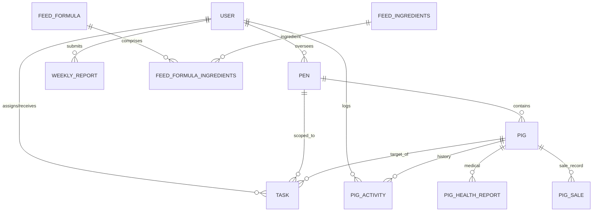

# PorciTrack Database Specifications

This document serves as the technical reference for the PorciTrack database architecture, providing a detailed data dictionary and operational logic for livestock management.

## 📊 Entity Relationship Diagram (ERD)

## 📖 Data Dictionary

### 0. `users` (System Accounts)
Stores information for Administrators and Farm Workers.
| Column | Type | Nullable | Description |
| :--- | :--- | :--- | :--- |
| `id` | BIGINT (PK) | NO | Primary internal identifier. |
| `name` | VARCHAR | NO | Full name of the user. |
| `email` | VARCHAR | NO | Unique login email address. |
| `role` | VARCHAR | NO | Access level: `admin` or `farm_worker`. |
| `status` | BOOLEAN | NO | Account state (1 = Active, 0 = Disabled). |
| `phone` | VARCHAR | YES | Contact number for worker coordination. |
| `region` | VARCHAR | YES | Assigned geographical region for biosecurity. |
| `birthdate` | DATE | YES | User's date of birth. |

### 1. `pigs` (Livestock Master Record)
Maintains the real-time state of each animal on the farm.
| Column | Type | Nullable | Description |
| :--- | :--- | :--- | :--- |
| `id` | BIGINT (PK) | NO | Primary internal identifier. |
| `tag` | VARCHAR | NO | Unique public Ear Tag (e.g., PEN-A-01). |
| `pen_id` | BIGINT (FK) | NO | Reference to the current housing `pens`. |
| `status` | VARCHAR | NO | Lifecycle state: `Active`, `Sold`, `Disposed`. |
| `health_status` | ENUM | NO | Current health: `Healthy`, `Warning`, `Sick`. |
| `feeding_status` | ENUM | NO | Appetite state: `Active`, `Normal`, `Poor`. |
| `weight` | INT | YES | Last recorded body weight in kilograms. |
| `bcs_score` | INT | NO | Body Condition Score (1-5 scale). |
| `symptoms` | VARCHAR | YES | Persistent notes on observed illness. |

### 2. `pens` (Housing Units)
| Column | Type | Nullable | Description |
| :--- | :--- | :--- | :--- |
| `id` | BIGINT (PK) | NO | Primary identifier. |
| `name` | VARCHAR | NO | Display name (e.g., "Pen 01"). |
| `section` | VARCHAR | YES | Farm zone (e.g., "Farrowing", "Finishing"). |
| `assigned_to` | BIGINT (FK) | YES | Worker ID responsible for this pen. |
| `progress` | INT | NO | Average growth progress toward target (0-100%). |
| `healthy_pigs` | INT | NO | Cached count of healthy animals. |
| `sick_pigs` | INT | NO | Cached count of animals flagged as sick. |

### 3. `pig_activities` (Event Log & Critical Alerts)
The primary source of truth for the farm's audit trail.
| Column | Type | Nullable | Description |
| :--- | :--- | :--- | :--- |
| `id` | BIGINT (PK) | NO | Primary identifier. |
| `pig_id` | BIGINT (FK) | NO | Associated animal. |
| `user_id` | BIGINT (FK) | NO | Person who performed the action. |
| `type` | VARCHAR | NO | Category: `Care`, `Medical`, `Movement`, `Growth`. |
| `action` | VARCHAR | NO | Short summary: "Daily Assessment", "Vaccination". |
| `details` | TEXT | YES | Detailed observations or specific medications. |
| `is_critical_alert`| BOOLEAN | NO | If `true`, flags as an Emergency for Admin. |
| `acknowledged_at`| DATETIME | YES | When the Admin responded to the alert. |

### 4. `tasks` (Operational Workflow)
| Column | Type | Nullable | Description |
| :--- | :--- | :--- | :--- |
| `id` | BIGINT (PK) | NO | Primary identifier. |
| `title` | VARCHAR | NO | Task summary. |
| `assigned_to` | BIGINT (FK) | NO | Worker ID assigned to the task. |
| `status` | VARCHAR | NO | `pending`, `completed`, `overdue`. |
| `progress` | INT | NO | Completion percentage (0-100%). |
| `findings` | JSON | YES | Worker notes or field results (e.g., water pH). |

---

## ⚙️ Operational Logic

### 🚀 Critical Alert Lifecycle
1. **Trigger**: Worker submits a check-in with `health_status = 'Sick'` or logs a Medical Emergency.
2. **Persistence**: A row is created in `pig_activities` with `is_critical_alert = true`.
3. **Escalation**: The Admin Dashboard queries for any `is_critical_alert` where `acknowledged_at IS NULL`.
4. **Resolution**: Admin views the alert and submits a response, updating `acknowledged_at` and `acknowledged_by`.

### 📶 Offline-to-Online Data Integrity
Since the system operates offline-first:
- **Client-Side GUID**: Every offline entry is assigned a temporary `id` (timestamp) in LocalStorage.
- **Batched Sync**: When online, the browser sends these entries to the server.
- **Server Ordering**: The server relies on the user's `savedAt` timestamp to maintain the correct historical order of activities.

---
*Last Updated: 2026-04-29*
